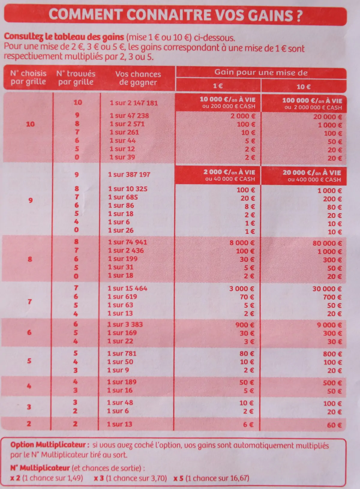

```{r}
#| label: setup
#| include: false

# ─────────────────────────────────────────────────────────────
# CHARGEMENT DES BIBLIOTHÈQUES PRINCIPALES
# ─────────────────────────────────────────────────────────────
library(tidyverse)
library(conflicted)
library(scales)
library(patchwork)
library(knitr)
library(kableExtra)
library(lubridate)
library(readr)
library(mvtnorm)
library(mclust)
library(ggforce)
library(viridis)
library(ggdendro)
library(broom)
library(factoextra)
library(htmltools)

## Résolution des conflits de namespace
conflicts_prefer(dplyr::select)
conflicts_prefer(dplyr::filter)
conflicts_prefer(dplyr::lag)

# ─────────────────────────────────────────────────────────────
# THÈME GLOBAL GGPLOT2
# ─────────────────────────────────────────────────────────────
theme_set(
  theme_minimal(base_size = 13) +
    theme(
      panel.grid.minor  = element_blank(),
      legend.position   = "bottom",
      plot.title        = element_text(face = "bold", size = 14),
      plot.subtitle     = element_text(color = "grey40", size = 11)
    )
)

options(
  ggplot2.continuous.colour = "viridis",
  ggplot2.continuous.fill   = "viridis"
)

# ─────────────────────────────────────────────────────────────
# CHRONOMÈTRE GLOBAL — Phase knitr
# ─────────────────────────────────────────────────────────────
t_knitr_start <- proc.time()
assign(".t_knitr_start", t_knitr_start, envir = .GlobalEnv)

# ── Fonctions portables de détection CPU et RAM ──────────────────────────
# Compatibles Windows, macOS et Linux sans package supplémentaire.

get_cpu_name <- function() {
  os <- Sys.info()["sysname"]
  result <- tryCatch({
    if (os == "Windows") {
      raw <- system("wmic cpu get Name /value", intern = TRUE)
      raw <- raw[grepl("^Name=", raw)]
      trimws(gsub("^Name=", "", raw[1]))
    } else if (os == "Darwin") {          # macOS
      trimws(system("sysctl -n machdep.cpu.brand_string", intern = TRUE)[1])
    } else {                               # Linux
      raw <- system("lscpu 2>/dev/null | grep 'Model name'", intern = TRUE)
      if (length(raw) == 0L) raw <- readLines("/proc/cpuinfo")[
        grepl("^model name", readLines("/proc/cpuinfo"))][1]
      trimws(gsub(".*:\\s*", "", raw[1]))
    }
  }, error = function(e) NA_character_)
  if (is.na(result) || nchar(result) == 0) Sys.info()["nodename"] else result
}

get_ram_go <- function() {
  os <- Sys.info()["sysname"]
  tryCatch({
    if (os == "Windows") {
      raw <- system("wmic ComputerSystem get TotalPhysicalMemory /value",
                    intern = TRUE)
      raw <- raw[grepl("TotalPhysicalMemory=", raw)]
      round(as.numeric(gsub("TotalPhysicalMemory=", "", raw)) / 1e9, 1)
    } else if (os == "Darwin") {          # macOS
      bytes <- as.numeric(system("sysctl -n hw.memsize", intern = TRUE))
      round(bytes / 1e9, 1)
    } else {                               # Linux
      raw <- system("grep MemTotal /proc/meminfo", intern = TRUE)
      kb  <- as.numeric(gsub("[^0-9]", "", raw))
      round(kb * 1024 / 1e9, 1)
    }
  }, error = function(e) NA_real_)
}

cpu_name <- get_cpu_name()
ram_go   <- get_ram_go()

t_debut_str <- format(Sys.time(), "%d/%m/%Y %H:%M:%S")

# Initialisation du fichier de stats
sysinfo_vec <- data.frame(
  Parametre = c("Plateforme", "OS", "Version R",
                "Processeur", "Coeurs logiques",
                "RAM totale (Go)", "Début phase knitr"),
  Valeur = c(
    .Platform$OS.type,
    paste(Sys.info()["sysname"], Sys.info()["release"]),
    R.version.string,
    cpu_name,
    parallel::detectCores(),
    as.character(ram_go),
    t_debut_str
  )
)

write(
  c("========================================",
    "  RAPPORT DE COMPILATION — ESD113 (HTML)",
    "========================================",
    sprintf("%-20s %s", sysinfo_vec$Parametre, sysinfo_vec$Valeur),
    sprintf("[KNITR_START] %s", t_debut_str),
    "========================================",
    "TEMPS PAR CHUNK :"),
  file = "compilation_stats_html.txt"
)

# Hook timer — mesure chaque chunk individuellement
knitr::knit_hooks$set(timer = function(before, options, envir) {
  if (before) {
    assign(".chunk_timer", proc.time(), envir = .GlobalEnv)
  } else {
    elapsed <- proc.time() - get(".chunk_timer", envir = .GlobalEnv)
    write(
      sprintf("[TIMER] %-35s : %.2f sec",
              options$label, elapsed["elapsed"]),
      file   = "compilation_stats_html.txt",
      append = TRUE
    )
  }
})

knitr::opts_chunk$set(timer = TRUE)
```

---

# Remerciements {.unnumbered}

::: {.callout-note icon=false}
## ❤️ À celles et ceux sans qui rien de tout cela n'aurait été possible
:::

À **Rhizlane**, mon épouse.

Les soirées passées sur ces pages, les week-ends confisqués par les algorithmes et les compilations récalcitrantes --- tu les as vécus avec une patience et une générosité qui forcent l'admiration. Tu as tenu la maison, organisé les journées, rassuré les enfants qui demandaient où était papa, et tu l'as fait avec cette force tranquille qui te caractérise. Ce travail t'appartient autant qu'à moi. Merci d'avoir cru, sans jamais fléchir, que ces efforts en valaient la peine.

À **mes deux enfants**,

Vous avez souvent dû vous passer de moi à des moments où un père devrait être présent --- les jeux du soir, les histoires du coucher, les repas en famille que l'écran a parfois remplacés. Vous avez accepté ces absences avec une maturité touchante, et chacun de vos sourires, chacune de vos questions sur "ce que fait papa sur l'ordinateur", m'a redonné l'énergie de continuer. Je vous dois du temps, de la présence, et je m'y engage. Ce document, c'est aussi votre victoire.

À **Monsieur Karim Kiliani**, responsable de l'unité d'enseignement ESD113,

Rares sont les enseignants qui parviennent à rendre la statistique non seulement accessible, mais véritablement désirable. Votre pédagogie rigoureuse, votre disponibilité et votre souci constant de contextualiser les méthodes ont transformé ce cours en une exploration intellectuelle passionnante. Merci de consacrer votre expertise à des auditeurs comme nous, qui jonglent entre vie professionnelle et ambition académique.

Au **CNAM**,

Permettre à un auditeur qui approche la cinquantaine, au cœur d'une vie active intense, de se former aux méthodes quantitatives avancées, à la data science, à R et à Quarto --- c'est un acte de foi dans l'idée que l'éducation n'a pas d'âge et que l'apprentissage tout au long de la vie n'est pas un slogan mais une réalité concrète. Le CNAM incarne cette conviction avec une constance exemplaire depuis plus de deux siècles. Il est difficile d'exprimer combien ce dispositif représente, pour des professionnels comme moi, une chance inestimable de rester dans la course d'un monde qui accélère. Merci d'exister, merci de persévérer, merci d'accueillir ceux que les circuits classiques ne peuvent plus atteindre.

---

# Introduction générale {#sec-intro-generale}

Ce document a été réalisé dans le cadre de l'unité d'enseignement **ESD113 --- Probabilités et statistiques avec R**, dispensée au Conservatoire National des Arts et Métiers (CNAM) par Monsieur Karim Kiliani.

Un recours significatif aux outils d'intelligence artificielle a permis de résoudre les problématiques complexes de mise en page et de structuration du contenu.

Ce document fusionne trois volets complémentaires du cours :

1. **Volet 1 --- Introduction à R, Quarto et Tidyverse :** prise en main de l'environnement de travail, manipulation de données, visualisation.
2. **Volet 2 --- Projet Keno :** application à un cas concret avec les données de tirage du Keno (FDJ), incluant modélisation probabiliste et simulation de Monte-Carlo.
3. **Volet 3 --- Méthodes de clustering :** reproduction et adaptation du code R de l'article de référence *"A Survey of Popular R Packages for Cluster Analysis"* (Flynt & Dean, 2016), couvrant K-means, classification hiérarchique ascendante et modèles de mélanges gaussiens (Mclust).

Le fil conducteur est la **rigueur reproductible** : chaque résultat est produit directement par le code R présenté, dans un document Quarto compilable.

Toutes les analyses sont réalisées avec R [@r2024] et Quarto [@quarto2024].

---

# Partie I --- Introduction à R, Quarto et Tidyverse {.unnumbered}

---

# Initiation à R, Quarto et Markdown {#sec-intro}

## Présentation générale

Ce premier volet est une introduction pratique au langage **R** et à l'environnement de publication **Quarto**. L'objectif est triple :

1. **Découvrir Quarto** : un système de publication scientifique qui mêle texte, code et résultats dans un seul document.
2. **Maîtriser les bases de R et du Tidyverse** : manipulation de données, statistiques descriptives, visualisation.
3. **Appliquer ces outils à un cas réel** : les données de tirage du **Keno FDJ**, avec modélisation probabiliste et simulation de Monte-Carlo.

> **Analogie pédagogique :** Quarto, c'est comme un cahier de laboratoire numérique : on y écrit ses observations (le texte), on y insère ses protocoles (le code R), et les résultats apparaissent automatiquement à la compilation. Plus besoin de copier-coller les sorties manuellement.

---

## Mise en forme du texte en Markdown

Quarto repose sur la syntaxe **Markdown** pour la mise en forme du texte. On peut écrire du texte en **gras** et en *italique*, insérer des listes, des tableaux, et bien sûr des formules mathématiques grâce à $\LaTeX$.

### Formules mathématiques

**L'intégrale de Gauss** — résultat fondamental en probabilité et statistique :

$$\int_{-\infty}^{+\infty} e^{-x^2}\, dx = \sqrt{\pi}$$

**La Transformée de Fourier (décomposition)** — elle extrait les fréquences d'un signal :

$$\hat{f}(\xi) = \int_{-\infty}^{+\infty} f(t)\, e^{-i 2\pi \xi t}\, dt$$

**La Transformée de Fourier inverse (reconstruction)** — elle reconstitue le signal à partir de sa « recette » fréquentielle :

$$f(t) = \int_{-\infty}^{+\infty} \hat{f}(\xi)\, e^{i 2\pi \xi t}\, d\xi$$

---

## Les chunks de code R

Un **chunk** est un bloc de code exécutable intégré au document. Le chunk ci-dessous génère la séquence des entiers de 1 à 20 :

```{r seq-entiers}
#| label: seq-entiers

seq(1, 20)   # Fonction générique : séquence de 1 à 20 par pas de 1
1:20         # Opérateur : notation compacte équivalente
```

Les années de Coupe du Monde de football entre 1970 et 2026 :

```{r seq-cdm}
#| label: seq-cdm

seq(1970, 2026, by = 4)
```

::: {.callout-tip}
## À retenir
La fonction `seq(de, à, by = pas)` est l'une des plus utiles de R. On peut aussi écrire `1:20` pour une séquence d'entiers consécutifs --- c'est la notation compacte équivalente à `seq(1, 20, by = 1)`.
:::

---

## Références bibliographiques dans Quarto

Quarto gère nativement les bibliographies grâce à **BibTeX**. Il suffit d'indiquer le fichier `.bib` dans l'en-tête YAML et de citer les références avec la syntaxe `@cle_bib`.

Par exemple, on peut citer l'article fondateur du Tidyverse : @wickham2019.

---

# Le Tidyverse {#sec-tidyverse}

## Présentation

Le **Tidyverse** est un écosystème de packages R conçu pour la *data science*. Tous ces packages partagent une même philosophie, une même grammaire et des structures de données communes (les *tibbles*).

Parmi les packages les plus utilisés :

- `dplyr` : manipulation des données (filtrer, sélectionner, grouper, résumer)
- `ggplot2` : visualisation graphique déclarative
- `tidyr` : restructuration des données (pivot, imbrication)
- `readr` : lecture de fichiers CSV et délimités
- `lubridate` : traitement des dates et heures
- `stringr` : manipulation des chaînes de caractères

## Manipulation d'un data frame en R de base

```{r base-r}
#| label: base-r

dfcars <- mtcars

dfcars$mpg          # Affiche les 32 valeurs de mpg (miles par gallon)

dfcars[, 1]         # Sélection de la 1ère colonne (toutes les lignes)

dfcars[1, ]         # Sélection de la 1ère ligne (toutes les colonnes)

dfcars[1, 1]        # Valeur unique : 1ère colonne, 1ère ligne
```

## Manipulations avec le Tidyverse et le pipe `|>`

Le **pipe natif** `|>` (disponible depuis R 4.1) permet de chaîner les opérations de gauche à droite :

```{r tidyverse-select}
#| label: tidyverse-select

dfcars |> dplyr::select(mpg)            # Sélection d'une colonne par son nom

select(dfcars, mpg)                     # Même résultat, sans le pipe

dfcars |> dplyr::select(7:11)           # Sélection des colonnes 7 à 11 (plage)
```

## Statistiques descriptives avec le Tidyverse

```{r stats-desc}
#| label: stats-desc

stat_des <- dfcars |>
  select(mpg) |>
  summarise(
    Moyenne      = mean(mpg),
    `Écart-type` = sd(mpg),
    Minimum      = min(mpg),
    Maximum      = max(mpg)
  )

stat_des |>
  kable(digits = 2, caption = "Statistiques descriptives de la variable mpg (mtcars)") |>
  kable_styling(bootstrap_options = c("striped", "hover"), full_width = FALSE)
```

---

# Introduction à la visualisation avec R {#sec-visu}

## Histogramme de base (R natif)

```{r hist-base}
#| label: hist-base

dfcars$mpg |> hist(main = "Histogramme de MPG pour les 32 voitures",
                   xlab = "Miles par gallon", col = "steelblue", border = "white")
```

On peut ensuite filtrer les voitures très économiques (30 à 35 mpg) :

```{r filter-mpg}
#| label: filter-mpg

dfcars |> filter(mpg >= 30 & mpg <= 35)
```

## Histogramme avec ggplot2

`ggplot2` offre une grammaire graphique déclarative : on décrit *ce que l'on veut voir*, et non *comment le dessiner*.

```{r ggplot-hist}
#| label: ggplot-hist

dfcars |>
  ggplot(aes(x = mpg)) +
  geom_histogram(fill = "#a12b4e", binwidth = 5, color = "white") +
  labs(
    title    = "Distribution de la consommation des 32 véhicules",
    subtitle = "Données : jeu intégré mtcars",
    x        = "Miles par gallon (mpg)",
    y        = "Nombre de véhicules"
  )
```

---

# Partie II --- Projet Keno : analyse des données FDJ {.unnumbered}

---

# Projet Keno --- Analyse des données FDJ {#sec-keno}

## Présentation du Keno

Le **Keno** est un jeu de tirage proposé par la Française des Jeux (FDJ). Dans la version étudiée ici, **16 boules** sont tirées parmi **56** numérotées de 1 à 56. Le joueur coche jusqu'à 10 numéros, et ses gains dépendent du nombre de numéros cochés figurant parmi les boules tirées.

## Chargement des données

```{r load-data}
#| label: load-data

keno_202511 <- read_delim(
  "keno_202511.csv",
  delim          = ";",
  escape_double  = FALSE,
  col_types      = cols(
    date_de_forclusion = col_skip(),
    ...23              = col_skip()
  ),
  trim_ws        = TRUE
)

keno_202511 <- keno_202511 |> select(-c(1, 19, 20, 21))

names(keno_202511)
```

## Pivot longer : restructuration des données

### Le concept de pivot

Les données Keno arrivent au format **large** (wide) : chaque tirage est une ligne, avec 16 colonnes `boule1`, `boule2`, …, `boule16`. Pour les analyses statistiques, il est plus commode d'avoir un format **long** : une ligne par boule tirée.

```{r pivot-exemple}
#| label: pivot-exemple

table4a <- tibble(
  country = c("A", "B", "C"),
  `1999`  = c(700,   37000,  212000),
  `2000`  = c(2000,  80000,  213000)
)
table4a

table4a |>
  pivot_longer(
    cols      = 2:3,
    names_to  = "annee",
    values_to = "cas"
  )
```

### Application au Keno

```{r pivot-keno}
#| label: pivot-keno

keno_longer <- keno_202511 |>
  pivot_longer(
    cols            = 2:17,
    names_to        = "Boule",
    names_prefix    = "boule",
    values_to       = "Num_boule"
  ) |>
  mutate(
    Boule     = as.integer(Boule),
    Num_boule = as.integer(Num_boule)
  )

glimpse(keno_longer)
```

## Tableau de fréquence des boules

```{r freq-boules}
#| label: freq-boules

freq_boules <- keno_longer |>
  dplyr::count(Num_boule, name = "frequence")

freq_boules |> filter(frequence == min(frequence))
```

## Formatage des dates

```{r format-dates}
#| label: format-dates

keno_202511 <- keno_202511 |>
  mutate(date_de_tirage = as.Date(date_de_tirage, format = "%d/%m/%Y"))

keno_202511 |>
  summarise(
    date_min = format(min(date_de_tirage), "%d/%m/%Y"),
    date_max = format(max(date_de_tirage), "%d/%m/%Y")
  )
```

## Palmarès des numéros --- style FDJ {#sec-palmares}

Ce tableau reproduit le style du **palmarès des numéros** affiché sur le site de la FDJ.

```{r palmares-fdj}
#| label: palmares-fdj

df_keno <- read_delim("keno_202511.csv", delim = ";", show_col_types = FALSE)

## ── Correction robuste du décompte des tirages ──────────────────────────────
## nrow(df_keno) peut surestimer si le CSV contient des lignes parasites.
## On compte le nombre de dates de tirage VALIDES et DISTINCTES après parsing.
total_tirages <- df_keno |>
  mutate(date_dt = dmy(date_de_tirage)) |>
  filter(!is.na(date_dt)) |>
  distinct(date_dt) |>
  nrow()

message("Nombre de tirages distincts retenus : ", total_tirages)

freq_boules_fdj <- df_keno |>
  pivot_longer(
    cols     = matches("^boule[0-9]+$"),
    names_to = "position",
    values_to = "Num_boule"
  ) |>
  mutate(
    date_dt   = dmy(date_de_tirage),
    Num_boule = as.integer(Num_boule)
  ) |>
  filter(!is.na(date_dt), !is.na(Num_boule)) |>
  group_by(Num_boule) |>
  summarise(
    Sorties  = n(),
    ## Pct = Sorties / total_tirages * 100 (ex. 30 sorties sur 100 → 30.00 %)
    Pct      = (n() / total_tirages) * 100,
    Derniere = max(date_dt, na.rm = TRUE)
  ) |>
  arrange(Num_boule)

fdj_style <- tags$style(HTML("
  .fdj-title { font-family: sans-serif; font-size: 1.2em; font-weight: bold;
    margin-bottom: 5px; color: #000; }
  .fdj-subtitle { font-family: sans-serif; font-size: 0.9em; color: #666; margin-bottom: 20px; }
  .fdj-table { font-family: sans-serif !important; border-collapse: collapse !important;
    width: 100% !important; margin-bottom: 30px; }
  .fdj-table thead th { border-bottom: 2px solid #f2f2f2 !important; padding: 15px !important;
    font-weight: bold; color: #000; background-color: white !important; }
  .fdj-table td { border-bottom: 1px solid #f2f2f2 !important; padding: 12px !important;
    font-size: 14px; vertical-align: middle; background-color: white !important; }
  .fdj-table tr:hover { background-color: #f9f9f9 !important; }
  .dot  { color: #a12b4e; margin-left: 10px; font-size: 18px; }
  .num-bold { font-weight: bold; color: #000; }
"))

header_html <- HTML('
  <div class="fdj-title">Palmarès des numéros</div>
  <div class="fdj-subtitle">Statistiques calculées sur la base des tirages du midi et du soir.</div>
')

tableau_final <- freq_boules_fdj |>
  mutate(
    Num_boule = paste0('<span class="num-bold">', Num_boule, '</span>',
                       '<span class="dot">●</span>'),
    Pct      = paste0(sprintf("%.2f", Pct), " %"),
    Derniere = format(Derniere, "%d/%m/%y")
  ) |>
  select(
    `Numéros`           = Num_boule,
    `Nombre de sorties` = Sorties,
    `% de sorties*`     = Pct,
    `Dernière sortie`   = Derniere
  ) |>
  kable(escape = FALSE, align = "lccc", format = "html",
        table.attr = 'class="fdj-table"')

tagList(
  fdj_style,
  header_html,
  HTML(tableau_final),
  tags$p(style = "font-size: 0.8em; color: #666; font-family: sans-serif;",
         paste0("* Le pourcentage de sorties est calculé par rapport au nombre de tirages valides distincts ",
                "(N = ", total_tirages, "). Formule : sorties / N × 100."))
)
```

## Statistiques sur le format long

```{r keno-long}
#| label: keno-long

keno_long <- keno_202511 |>
  pivot_longer(
    cols            = boule1:boule16,
    names_to        = "boule",
    names_prefix    = "boule",
    names_transform = list(boule = as.integer),
    values_to       = "numero"
  )

table_freq <- keno_long |>
  dplyr::count(numero, name = "Nombre de sorties") |>
  complete(numero = 1:56, fill = list(`Nombre de sorties` = 0)) |>
  arrange(numero)

table_freq |>
  kable(col.names = c("Numéro", "Nombre de sorties"),
        caption   = "Fréquence d'apparition des numéros (Keno — données FDJ)") |>
  kable_styling(bootstrap_options = c("striped", "hover", "condensed"), full_width = FALSE)
```

---

# Visualisations graphiques du Keno {#sec-graphiques}

## Histogramme des fréquences

```{r barchart-freq}
#| label: barchart-freq

freq_boules_plot <- keno_long |>
  dplyr::count(numero, name = "frequence") |>
  complete(numero = 1:56, fill = list(frequence = 0)) |>
  arrange(numero)

freq_boules_plot |>
  ggplot(aes(x = numero, y = frequence, fill = frequence)) +
  geom_bar(stat = "identity", color = "white", width = 0.8) +
  scale_fill_gradient(low = "green", high = "blue") +
  labs(
    title    = "Fréquence d'apparition de chaque numéro du Keno",
    subtitle = "Données FDJ — tirages du midi et du soir",
    x        = "Numéro de boule (1 à 56)",
    y        = "Nombre de sorties",
    fill     = "Fréquence"
  ) +
  theme(legend.position = "right")
```

## Graphique circulaire (diagramme en rose)

Ce graphique polaire enroule les 56 numéros autour d'un axe circulaire, permettant de visualiser d'un coup d'œil l'uniformité des tirages :

```{r polar-chart}
#| label: polar-chart
#| fig-height: 7
#| fig-width: 7

freq_boules_plot |>
  ggplot(aes(
    x    = reorder(as.factor(numero), as.numeric(numero)),
    y    = frequence,
    fill = frequence
  )) +
  geom_bar(stat = "identity", show.legend = FALSE, color = "white") +
  coord_polar(theta = "x", clip = "off") +
  geom_text(aes(y = 40, label = numero), color = "black", size = 3, fontface = "bold") +
  ylim(-2, max(freq_boules_plot$frequence) + 2) +
  scale_fill_gradient(low = "green", high = "blue") +
  labs(title    = "Répartition circulaire des fréquences",
       subtitle = "Chaque secteur représente un numéro (1 à 56)") +
  theme_void() +
  theme(plot.title    = element_text(face = "bold", hjust = 0.5, size = 11),
        plot.subtitle = element_text(hjust = 0.5, color = "grey40", size = 9),
        plot.margin   = margin(0, 0, 0, 0, "pt"),
        aspect.ratio  = 1)
```

---

# Modélisation probabiliste du Keno {#sec-proba}

## La loi hypergéométrique

Le Keno est un tirage **sans remise** : les boules ne sont pas replacées dans l'urne. La distribution de probabilité qui modélise ce type de tirage est la **loi hypergéométrique** :

$$P(X = x) = \frac{\binom{K}{x}\binom{N-K}{n-x}}{\binom{N}{n}}$$

Où :

- $N = 56$ : taille totale de l'urne (boules numérotées de 1 à 56)
- $K = 16$ : nombre de boules tirées par le Keno
- $n = 10$ : nombre de numéros cochés par le joueur
- $x$ : nombre de numéros cochés qui correspondent à des boules tirées

La fonction R correspondante est `dhyper(x, m, n, k)` où `m` est le nombre de boules « succès » dans l'urne, `n` le nombre de boules « échec », et `k` le nombre de tirages.

## Calcul des probabilités de gain

```{r proba-gain}
#| label: proba-gain

tibble(
  x      = 0:10,
  `p(x)` = dhyper(0:10, m = 16, n = 40, k = 10),
  chance = round(1 / `p(x)`)
)
```

## Tableau des gains officiels FDJ

Le tableau ci-dessous croise les probabilités calculées avec les **gains officiels** publiés par la FDJ (pour une mise de 1 €).

```{r tableau-gains}
#| label: tableau-gains

tableau_gains <- tibble(
  x       = 0:10,
  `p(x)`  = dhyper(x, m = 16, n = 40, k = 10)
) |>
  arrange(desc(x)) |>
  filter(!x %in% 1:4) |>
  mutate(`g(x) en €` = c(200000, 2000, 150, 15, 5, 2, 2), .after = x)

tableau_gains |>
  kable(digits = 6,
        caption   = "Gains officiels FDJ et probabilités associées (mise de 1 €, 10 numéros cochés)",
        col.names = c("Bonnes boules (x)", "Gain g(x) en €", "Probabilité p(x)")) |>
  kable_styling(bootstrap_options = c("striped", "hover"), full_width = FALSE) |>
  row_spec(1, bold = TRUE, color = "white", background = "#a12b4e")
```

---

# Référence officielle FDJ : tableau complet des gains {#sec-ref-fdj}

## Les tableaux de gains officiels

Les probabilités et gains présentés dans cette section sont calculés à partir des règles officielles du Keno FDJ. Les sources officielles sont consultables en ligne :

- **Probabilités et chances de gagner** : [fdj.fr — Quelles sont les chances de gagner au Kéno ?](https://www.fdj.fr/mag/questions/article-quelles-les-chances-de-gagner-keno-190326)
- **Statistiques officielles des tirages** : [fdj.fr — Kéno Statistiques](https://www.fdj.fr/jeux-de-tirage/keno/statistiques)

::: {.callout-warning}
## Note sur le modèle utilisé
Les tableaux de gains de ce document sont calculés sur le modèle **16 boules tirées parmi 56**, qui correspond exactement aux données historiques disponibles (`keno_202511.csv`). Ce modèle a été en vigueur jusqu'en 2020 ; la version actuelle du Keno FDJ tire 20 boules parmi 70. Les **gains officiels** (montants en euros) sont identiques entre les deux versions, mais les **probabilités** calculées par `dhyper()` diffèrent. Toutes les analyses de ce document restent cohérentes en se basant systématiquement sur le modèle 16/56.
:::

<div style="display: flex; gap: 1.5rem; justify-content: center; flex-wrap: wrap; margin: 1.5rem 0;">
  <figure style="text-align: center; margin: 0;">
    
    <figcaption style="font-size: 0.85em; color: #555; margin-top: 0.5rem;">
      <em>Tableau officiel FDJ — grilles 9 et 10 numéros (version récente)</em>
    </figcaption>
  </figure>
  <figure style="text-align: center; margin: 0;">
    
    <figcaption style="font-size: 0.85em; color: #555; margin-top: 0.5rem;">
      <em>Tableau officiel FDJ — toutes grilles de 2 à 10 numéros (version 2020)</em>
    </figcaption>
  </figure>
</div>

## Construction de la table complète des gains FDJ {#sec-gains-complet}

Nous reproduisons ici le tableau officiel FDJ pour **toutes les grilles** (de 2 à 10 numéros cochés), en calculant les probabilités théoriques avec `dhyper()` et en renseignant les gains officiels conformément au règlement FDJ — modèle 16 boules tirées sur 56, cohérent avec les données keno_202511.csv.

```{r gains-data}
#| label: gains-data

## ── Paramètres du Keno FDJ — modèle des données historiques ─────────────────
## Les données keno_202511.csv correspondent à l'ancienne version du Keno :
## 16 boules tirées parmi 56.  Toutes les probabilités sont calculées sur ce
## modèle pour rester cohérentes avec les analyses empiriques du document.
## Note : la version en vigueur depuis 2020 tire 20 boules parmi 70 ; les gains
##        officiels affichés sont identiques, mais les probabilités diffèrent.
N_keno <- 56   # taille de l'urne (version historique — données keno_202511.csv)
K_keno <- 16   # boules tirées par tirage (version historique)

## Table des gains officiels FDJ (mise 1 €) — source : article 8 du règlement
## FDJ (modèle 16/56 correspondant aux données disponibles).
gains_fdj <- list(
  `10` = list(`10` = 200000, `9` = 2000, `8` = 150, `7` = 15,
              `6`  = 5,      `5` = 2,    `0` = 2),
  `9`  = list(`9`  = 30000,  `8` = 100,  `7` = 25,  `6` = 8,
              `5`  = 2,      `4` = 1,    `0` = 2),
  `8`  = list(`8`  = 8000,   `7` = 100,  `6` = 30,  `5` = 5,  `0` = 2),
  `7`  = list(`7`  = 3000,   `6` = 90,   `5` = 5,   `4` = 2),
  `6`  = list(`6`  = 900,    `5` = 30,   `4` = 3),
  `5`  = list(`5`  = 80,     `4` = 10,   `3` = 2),
  `4`  = list(`4`  = 70,     `3` = 3),
  `3`  = list(`3`  = 10,     `2` = 2),
  `2`  = list(`2`  = 6)
)

message("Table des gains FDJ chargée : ", length(gains_fdj), " grilles définies (2 à 10 numéros).")
```

```{r gains-calcul-long}
#| label: gains-calcul-long
#| dependson: "gains-data"

df_gains_long <- purrr::imap_dfr(gains_fdj, function(gains_grille, n_coches_chr) {
  n <- as.integer(n_coches_chr)
  purrr::imap_dfr(gains_grille, function(gain, n_trouves_chr) {
    x <- as.integer(n_trouves_chr)
    p <- dhyper(x, m = K_keno, n = N_keno - K_keno, k = n)
    tibble(
      n_coches   = n,
      n_trouves  = x,
      prob       = p,
      chance     = if (p > 0) round(1 / p) else NA_real_,
      gain_1eur  = gain,
      gain_10eur = gain * 10
    )
  })
}) |>
  arrange(desc(n_coches), desc(n_trouves))

message("Tableau long construit : ", nrow(df_gains_long), " lignes.")
```

```{r gains-tableau-10}
#| label: gains-tableau-10
#| dependson: "gains-calcul-long"

df_gains_long |>
  filter(n_coches == 10) |>
  select(
    `N° trouvés`      = n_trouves,
    `Probabilité`     = prob,
    `1 chance sur...` = chance,
    `Gain (1 €)`      = gain_1eur,
    `Gain (10 €)`     = gain_10eur
  ) |>
  kable(
    digits      = 7,
    format.args = list(big.mark = " "),
    caption     = "Grille à 10 numéros cochés — probabilités et gains officiels FDJ (16 boules sur 56, mise 1 euro)"
  ) |>
  kable_styling(
    bootstrap_options = c("striped", "hover", "condensed"),
    font_size         = 10,
    full_width        = FALSE
  ) |>
  row_spec(1, bold = TRUE, color = "white", background = "#a12b4e") |>
  column_spec(4, bold = TRUE)
```

```{r gains-tableau-complet}
#| label: gains-tableau-complet
#| dependson: "gains-calcul-long"

groupes <- df_gains_long |>
  mutate(row_id = row_number()) |>
  group_by(n_coches) |>
  summarise(debut = min(row_id), fin = max(row_id), .groups = "drop") |>
  arrange(desc(n_coches))

tbl_complet <- df_gains_long |>
  mutate(
    prob_fmt   = formatC(prob,   format = "e", digits = 3),
    chance_fmt = formatC(chance, format = "fg", big.mark = " ",
                         flag = "#") |> stringr::str_trim(),
    gain_fmt   = paste0(formatC(gain_1eur, format = "fg", big.mark = " "), " €")
  ) |>
  select(
    `Grille`       = n_coches,
    `N° trouvés`   = n_trouves,
    `p(x)`         = prob_fmt,
    `1 chance sur` = chance_fmt,
    `Gain (1 €)`   = gain_fmt
  )

tbl_obj <- tbl_complet |>
  kable(
    align   = c("c","c","r","r","r"),
    caption = "Table complète des gains FDJ — toutes grilles de 2 à 10 numéros cochés (16 boules tirées sur 56, mise 1 euro)",
    linesep = ""
  ) |>
  kable_styling(
    bootstrap_options = c("striped", "hover", "condensed"),
    font_size         = 9,
    full_width        = FALSE
  )

for (i in seq_len(nrow(groupes))) {
  tbl_obj <- tbl_obj |>
    pack_rows(
      paste0(groupes$n_coches[i], " numéros cochés"),
      groupes$debut[i],
      groupes$fin[i]
    )
}

tbl_obj
```

## Espérances de gain par grille {#sec-esperances-grilles}

::: {.callout-note}
## Rappel théorique
Pour chaque grille (nombre de numéros cochés $n$), l'espérance de gain se calcule en sommant les gains pondérés par leurs probabilités, sur toutes les combinaisons gagnantes :

$$E_n[G] = \sum_{x \in \mathcal{G}_n} g(x) \cdot p(x)$$

où $\mathcal{G}_n$ est l'ensemble des valeurs de $x$ donnant lieu à un gain pour la grille $n$.
:::

```{r esperances-grilles}
#| label: esperances-grilles
#| dependson: "gains-calcul-long"

df_esperances <- df_gains_long |>
  group_by(n_coches) |>
  summarise(
    esperance = sum(gain_1eur * prob, na.rm = TRUE),
    .groups   = "drop"
  ) |>
  mutate(
    trj_pct   = round(esperance * 100, 2),
    perte_moy = round(1 - esperance, 4)
  ) |>
  arrange(desc(n_coches))

df_esperances |>
  select(
    `N° cochés`                 = n_coches,
    `Espérance E[G]`            = esperance,
    `TRJ (%)`                   = trj_pct,
    `Perte moy. / tirage (EUR)` = perte_moy
  ) |>
  kable(
    digits   = 4,
    caption  = "Espérance de gain et taux de retour joueur (TRJ) par grille — Keno FDJ (mise 1 euro)"
  ) |>
  kable_styling(
    bootstrap_options = c("striped", "hover", "condensed"),
    font_size         = 10,
    full_width        = FALSE
  ) |>
  column_spec(3, bold = TRUE, color = "white",
              background = spec_color(df_esperances$trj_pct,
                                      option = "C", direction = -1,
                                      begin  = 0.3, end = 0.9))
```

::: {.callout-tip}
## À retenir
Le **taux de retour joueur (TRJ)** est la fraction de la mise que le joueur récupère **en moyenne** sur un très grand nombre de parties. Un TRJ de 50 % signifie que pour 1 € joué, le joueur récupère en moyenne 0,50 € et perd donc 0,50 €. Ce taux est encadré réglementairement par l'ARJEL (Autorité de régulation des jeux en ligne).
:::

```{r plot-esperances}
#| label: plot-esperances
#| fig-cap: "Espérance de gain selon le nombre de numéros cochés — Keno FDJ (mise 1 euro, modèle 16/56). Toutes les barres restent sous la ligne pointillée rouge, confirmant que l'espérance est toujours négative pour le joueur."
#| fig-height: 4.5
#| fig-width: 8
#| dependson: "esperances-grilles"

df_esperances |>
  ggplot(aes(x = factor(n_coches), y = esperance)) +
  geom_col(aes(fill = esperance), width = 0.65, show.legend = FALSE) +
  geom_hline(yintercept = 1, linetype = "dashed",
             color = "#a12b4e", linewidth = 0.7) +
  geom_text(aes(label = paste0(trj_pct, " %")),
            vjust = -0.5, size = 3.2, fontface = "bold", color = "gray20") +
  scale_fill_gradient(low = "#e8c4d0", high = "#a12b4e") +
  scale_y_continuous(
    labels = scales::label_number(suffix = " EUR", accuracy = 0.01),
    limits = c(0, 1.10),
    expand = expansion(mult = c(0, 0.02))
  ) +
  annotate("text", x = 0.6, y = 1.03, label = "Mise = 1 EUR",
           color = "#a12b4e", size = 3, hjust = 0, fontface = "italic") +
  labs(
    title    = "Espérance de gain selon le nombre de numéros cochés",
    subtitle = "Keno FDJ — mise de 1 euro — modèle 16/56",
    x        = "Nombre de numéros cochés",
    y        = "Espérance de gain (EUR)",
    caption  = "Source : gains officiels FDJ. La ligne pointillée rouge matérialise la mise de 1 EUR.\nEn dessous de cette ligne, le joueur perd en espérance."
  ) +
  theme_minimal() +
  theme(panel.grid.major.x = element_blank())
```

::: {.callout-warning}
## Lecture du graphique
Toutes les barres sont **sous la ligne pointillée rouge** (la mise de 1 €), confirmant que l'**espérance de gain est toujours négative pour le joueur**, quelle que soit la grille choisie. Le TRJ affiché au-dessus de chaque barre (en % de la mise) montre que la FDJ reverse entre 50 % et 60 % de la mise en gains — la différence constituant la marge opératrice.
:::

---

# Espérance de gain {#sec-esperance}

## Définition

L'**espérance mathématique** de gain est la valeur moyenne que le joueur peut espérer gagner par tirage :

$$E[G] = \sum_{x=0}^{10} g(x) \cdot p(x)$$

où $g(x)$ est le gain pour $x$ bonnes boules, et $p(x)$ la probabilité d'en obtenir exactement $x$.

## Calcul avec R

```{r esperance}
#| label: esperance

result <- tibble(
  x      = 0:10,
  `p(x)` = dhyper(x, m = 16, n = 40, k = 10)
) |>
  arrange(desc(x)) |>
  filter(!x %in% 1:4) |>
  mutate(`g(x)` = c(200000, 2000, 150, 15, 5, 2, 2), .after = x)

esperance <- result |>
  summarise(esperance = sum(`g(x)` * `p(x)`))

esperance
```

> **Interprétation :** Pour une mise de 1 €, l'espérance de gain est d'environ **`r round(esperance$esperance, 3)` €**. Cela signifie que le joueur perd en moyenne `r round(1 - esperance$esperance, 3)` € à chaque tirage — ce qui traduit la marge de la FDJ.

::: {.callout-warning}
## Point d'attention
L'espérance de gain est inférieure à 1 euro (la mise). Cela signifie que le joueur perd en moyenne de l'argent à chaque tirage --- c'est la **marge** intégrée par la FDJ dans le jeu. Ce résultat est fondamental en théorie des jeux et illustre pourquoi les jeux d'argent ne peuvent pas être des stratégies de gain à long terme.
:::

---

# Simulations de Monte-Carlo {#sec-montecarlo}

## Principe

La **simulation de Monte-Carlo** est une méthode numérique qui consiste à simuler un grand nombre de tirages aléatoires pour estimer des probabilités ou des distributions.

## Premier exemple : simulation simple

```{r montecarlo-simple}
#| label: montecarlo-simple

set.seed(123)

numeros <- c()
for (t in 1:100) {
  numeros <- c(numeros, sample(1:56, 16, replace = FALSE))
}
table(numeros) |> min()
```

La même simulation, plus élégamment avec `replicate()` :

```{r montecarlo-replicate}
#| label: montecarlo-replicate

set.seed(123)
numeros_simu <- as.vector(replicate(100, sample(1:56, 16, replace = FALSE)))
table(numeros_simu) |> min()
```

## Estimation d'une probabilité par Monte-Carlo

On répète l'expérience **N = 100 fois** pour estimer la probabilité qu'un numéro sorte 17 fois ou moins sur 100 tirages :

```{r montecarlo-proba}
#| label: montecarlo-proba

set.seed(123)
N <- 100

valmin <- replicate(N, {
  tirages <- replicate(100, sample(1:56, 16, replace = FALSE))
  counts  <- table(factor(as.vector(tirages), levels = 1:56))
  min(counts)
})

cat("Probabilité estimée P(min ≤ 17) =", sum(valmin <= 17) / N)
```

## Simulation de Monte-Carlo à grande échelle (1 000 itérations)

```{r montecarlo-grande-echelle}
#| label: montecarlo-grande-echelle

set.seed(123)
n_simulations     <- 1000
tirages_par_serie <- 100

simuler_min <- function() {
  resultats <- replicate(tirages_par_serie, sample(1:56, 16, replace = FALSE))
  counts    <- table(factor(resultats, levels = 1:56))
  return(min(counts))
}

simus    <- replicate(n_simulations, simuler_min())
df_simus <- data.frame(id = 1:n_simulations, val_min = simus)

ggplot(df_simus, aes(x = id, y = val_min)) +
  geom_point(alpha = 0.3, color = "#282D87", size = 0.9) +
  geom_smooth(method = "lm", color = "#a12b4e", se = TRUE) +
  labs(
    title    = "Simulation de Monte-Carlo : fréquence minimale d'apparition",
    subtitle = "1 000 séries de 100 tirages — Keno (16 boules parmi 56)",
    x        = "Numéro de simulation",
    y        = "Minimum d'apparition sur 100 tirages"
  ) +
  theme_minimal()

seuil_critique <- mean(simus)
cat("En moyenne, sur 100 tirages, le numéro le moins sorti apparaît",
    round(seuil_critique, 1), "fois.")
```

::: {.callout-tip}
## À retenir
La droite de régression (quasiment horizontale) confirme que le processus est **stationnaire** : le minimum d'apparition ne dérive pas au fil des simulations. C'est une propriété attendue d'un tirage véritablement aléatoire et uniforme.
:::

---

# Partie III --- Méthodes de clustering {.unnumbered}

---

# Introduction au clustering {#sec-intro-clustering}

Ce volet a été réalisé dans le cadre de la même unité d'enseignement **ESD113**. L'objectif principal est de reproduire et d'adapter le [code R](https://www.stats.gla.ac.uk/~nd29c/Software/ClusterReviewCode.R) utilisé dans l'article de référence **"A Survey of Popular R Packages for Cluster Analysis"** [@flynt2016].

## Qu'est-ce que le clustering ?

Imaginez que l'on vous donne un grand sac contenant mille pièces de puzzle mélangées, issues de plusieurs boites différentes. Votre mission : les trier *sans voir les images* des boites d'origine. Naturellement, vous examinerez les couleurs, les formes de bordures, les textures — vous regrouperez les pièces qui *se ressemblent*. Sans le savoir, vous appliquerez l'algorithme mental à la base de tout clustering.

En statistique, le **clustering** (ou *classification non supervisée*) consiste à regrouper automatiquement des observations similaires **sans connaitre à l'avance** les étiquettes ou catégories.

> **Analogie pédagogique :** Un algorithme de clustering appliqué à votre liste de courses pourrait découvrir, sans qu'on le lui dise, que vous achetez toujours ensemble des pâtes, de la sauce tomate et du parmesan — et créer un "groupe culinaire" reflétant ce comportement. C'est de la connaissance extraite automatiquement de l'observation brute.

## Bref panorama historique

### La petite (et longue) histoire de l'algorithme de Lloyd

Si l'on devait décerner le prix de la "patience algorithmique", Stuart Lloyd serait sans doute sur le podium. Imaginez la scène : nous sommes en **1957**, dans les prestigieux Laboratoires Bell. Entre deux tasses de café noir et des montagnes de tubes à vide, Lloyd pose les bases de ce qui deviendra le moteur de calcul le plus utilisé au monde pour le clustering : l'algorithme de quantification par moindres carrés.

Il faudra attendre **1982** — soit 25 ans après sa conception initiale ! — pour que le travail de Lloyd [-@lloyd1982] soit enfin publié officiellement dans les *IEEE Transactions on Information Theory*. C'est un peu comme si quelqu'un inventait la roue en secret, la rangeait dans son garage, et attendait que tout le monde roule en carrosse pour enfin publier le brevet !

Quelques jalons historiques essentiels :

- **1894** — Karl Pearson [-@pearson1894] utilise les premiers mélanges gaussiens pour analyser des populations de crabes dans la Baie de Naples. C'est l'acte de naissance des modèles de mélanges.
- **Années 1950–1960** — Les biologistes développent la *taxinomie numérique*. Les premières méthodes hiérarchiques émergent [@everitt2011].
- **1963** — Joe Ward [-@ward1963] formalise la méthode de liaison de Ward.
- **1967** — James MacQueen [-@macqueen1967] publie l'article fondateur du **K-means**.
- **1977** — Dempster, Laird et Rubin [-@dempster1977] formalisent l'algorithme **EM**.
- **2002** — Fraley et Raftery [-@fraley2002] publient la référence sur `Mclust`.

## Objectifs et plan du volet clustering

Ce volet guide à travers **trois grandes familles de méthodes**, du plus simple au plus sophistiqué :

1. Simulation de données structurées pour évaluer les algorithmes.
2. K-means, méthode du coude et ses **six variations d'implémentation**.
3. Classification hiérarchique ascendante et dendrogramme.
4. Modèles de mélanges gaussiens avec `Mclust`.

---

# Préparation de l'environnement R pour le clustering {#sec-packages-clustering}

```{r packages-clustering}
#| label: packages-clustering

library(mvtnorm)      # Simulation de lois normales multivariées
library(mclust)       # Modèles de mélanges gaussiens + ARI
library(ggforce)      # Ellipses et hulls ggplot2
library(viridis)      # Palettes daltonisme-friendly
library(ggdendro)     # Dendrogrammes ggplot2
library(broom)        # Extraction standardisée de métriques
library(factoextra)   # Visualisation clustering

conflicts_prefer(dplyr::select)
conflicts_prefer(dplyr::filter)
conflicts_prefer(dplyr::lag)
```

---

# Simulation des données : créer un laboratoire contrôlé {#sec-simulation}

## Pourquoi simuler ?

Évaluer une méthode de clustering sur des données réelles pose un problème fondamental : on ne connait pas les *vrais* groupes, puisque c'est précisément ce qu'on cherche. La simulation résout ce problème en créant un monde artificiel où **la vérité est connue à l'avance**.

::: {.callout-tip}
## À retenir
La simulation est le mannequin de crash-test de la statistique : on connait exactement les forces appliquées, et on mesure comment chaque algorithme s'en sort.
:::

## Fondements mathématiques : la loi normale multivariée

**La loi normale univariée** (loi de Gauss) :

$$f(x) = \frac{1}{\sigma\sqrt{2\pi}} \exp\!\left(-\frac{(x-\mu)^2}{2\sigma^2}\right), \quad x \in \mathbb{R}$$

**La loi normale multivariée** $\mathcal{N}_p(\boldsymbol{\mu}, \boldsymbol{\Sigma})$ :

$$f(\boldsymbol{x}) = \frac{1}{(2\pi)^{p/2}|\boldsymbol{\Sigma}|^{1/2}} \exp\!\left(-\frac{1}{2}(\boldsymbol{x}-\boldsymbol{\mu})^\top\boldsymbol{\Sigma}^{-1}(\boldsymbol{x}-\boldsymbol{\mu})\right)$$

**Le modèle de mélange gaussien** (K = 3 composantes) :

$$f(\boldsymbol{x}) = \sum_{k=1}^{3} \pi_k \cdot \mathcal{N}_2(\boldsymbol{x}\,|\,\boldsymbol{\mu}_k, \boldsymbol{\Sigma}_k)$$

```{r tbl-params-simulation}
#| label: tbl-params-simulation

data.frame(
  Groupe     = c("Groupe 1", "Groupe 2", "Groupe 3"),
  Proportion = c("0.30", "0.40", "0.30"),
  Moyenne    = c("(0, 0)", "(3, 5)", "(0, 6)"),
  Covariance = c("Sphérique I₂", "Sphérique I₂", "Elliptique Σ_ell"),
  Difficulte = c("Facile", "Facile", "Difficile (ellipse inclinée)")
) |>
  kable(
    col.names  = c("Groupe", "Proportion π_k", "Moyenne μ_k", "Covariance Σ_k", "Difficulté"),
    caption    = "Paramètres des trois composantes gaussiennes du mélange simulé."
  ) |>
  kable_styling(bootstrap_options = c("striped", "hover"), full_width = FALSE) |>
  column_spec(5, italic = TRUE)
```

La matrice de covariance elliptique du Groupe 3 est :

$$\boldsymbol{\Sigma}_{ell} = \begin{pmatrix} 2 & 1.3 \\ 1.3 & 1 \end{pmatrix}$$

Elle traduit une variance plus forte selon $V_1$ et une corrélation positive entre $V_1$ et $V_2$, ce qui crée l'ellipse inclinée à environ 45 degrés.

## Simulation des variables continues

```{r fig-simul-donnees}
#| label: fig-simul-donnees

set.seed(288)

pi_vec <- c(0.3, 0.4, 0.3)
mu <- list(c(0, 0), c(3, 5), c(0, 6))

sigma_sph <- diag(2)
sigma_ell <- matrix(c(2, 1.3, 1.3, 1), nrow = 2, byrow = TRUE)

cl_real <- sample(1:3, size = 600, replace = TRUE, prob = pi_vec)

X_data <- purrr::map_dfr(cl_real, function(i) {
  sigma_i <- if (i == 3L) sigma_ell else sigma_sph
  rmvnorm(n = 1, mean = mu[[i]], sigma = sigma_i) |> as_tibble()
}) |>
  set_names(c("V1", "V2"))

X_plot <- X_data |>
  mutate(Groupe = as.factor(cl_real)) |>
  filter(!is.na(V1) & !is.na(V2))

couleurs_article <- c("1" = "black", "2" = "red", "3" = "green3")

ggplot(X_plot, aes(x = V1, y = V2, color = Groupe)) +
  geom_point(alpha = 0.5, size = 1.2, shape = 18) +
  ggforce::geom_mark_hull(
    aes(fill = Groupe), alpha = 0.10, color = NA,
    concavity = 10000, na.rm = TRUE, expand = unit(2, "mm")
  ) +
  scale_color_manual(values = couleurs_article, name = "Groupe réel",
                     labels = c("Groupe 1 (Black)", "Groupe 2 (Red)", "Groupe 3 (Green)")) +
  scale_fill_manual(values = couleurs_article) +
  labs(title    = "Données simulées : séparation par enveloppes convexes",
       subtitle = "Reproduction des couleurs originales de Flynt & Dean (2016)",
       x = "V1", y = "V2") +
  theme_minimal() +
  theme(legend.position = "bottom") +
  guides(fill = "none")
```

::: {.callout-warning}
## Point d'attention
Le Groupe 3 (en haut) forme une ellipse inclinée. Le K-means, qui suppose des clusters sphériques, aura du mal à le détecter correctement. Mclust, qui modélise explicitement les ellipses, le capturera bien.
:::

---

# Méthodes de partitionnement géométrique {#sec-partitionnement}

## K-means : la méthode des barycentres

### Principe et intuition

Le K-means est l'algorithme de clustering le plus célèbre et le plus utilisé au monde [@macqueen1967; @lloyd1982]. Son principe :

> *Chaque individu appartient au groupe dont le centre (la moyenne) lui est le plus proche.*

> **Analogie :** Imaginez 3 personnes dans une salle bondée, chacune criant : "Venez vers moi !" Chaque individu rejoint la plus proche. Puis chaque personne se déplace au centre géographique de son groupe. On recommence jusqu'à stabilisation. C'est exactement l'algorithme K-means.

### Formalisation mathématique

K-means minimise la **somme des distances au carré intra-cluster** (WSS) :

$$\mathrm{WSS} = \sum_{k=1}^{K} \sum_{\boldsymbol{x}_{i} \in C_{k}} \lVert \boldsymbol{x}_{i} - \boldsymbol{\mu}_{k} \rVert^{2}$$

### Choisir K : la méthode du coude

```{r fig-elbow}
#| label: fig-elbow

elbow_data <- tibble(k = 1:9) |>
  mutate(
    model = purrr::map(k, ~ kmeans(X_data, centers = .x, nstart = 50)),
    wss   = purrr::map_dbl(model, ~ .x$tot.withinss)
  )

ggplot(elbow_data, aes(x = k, y = wss)) +
  geom_line(color = "gray70", linewidth = 0.9) +
  geom_point(aes(color = (k == 3)), size = 3.5) +
  scale_color_manual(values = c("black", "#B40000")) +
  scale_x_continuous(breaks = 1:9) +
  labs(title = "Inertie intra-classe selon le nombre de clusters K",
       x     = "Nombre de clusters K",
       y     = "WSS (Within-Cluster Sum of Squares)") +
  guides(color = "none")
```

::: {.callout-warning}
## Limites du K-means
(1) il suppose des clusters sphériques, inadapté aux formes elliptiques ; (2) il est sensible aux valeurs aberrantes ; (3) il n'exprime aucune incertitude : chaque individu est assigné définitivement à un seul groupe ; (4) il ne fonctionne que sur des variables continues.
:::

### Six variations pour générer la courbe WSS

**Variation 1 --- Méthode manuelle**

```{r var1-manuelle}
#| label: var1-manuelle

km1 <- kmeans(X_data, 1, nstart = 50); km2 <- kmeans(X_data, 2, nstart = 50)
km3 <- kmeans(X_data, 3, nstart = 50); km4 <- kmeans(X_data, 4, nstart = 50)
km5 <- kmeans(X_data, 5, nstart = 50); km6 <- kmeans(X_data, 6, nstart = 50)
km7 <- kmeans(X_data, 7, nstart = 50); km8 <- kmeans(X_data, 8, nstart = 50)
km9 <- kmeans(X_data, 9, nstart = 50)

wss_man <- c(km1$tot.withinss, km2$tot.withinss, km3$tot.withinss,
             km4$tot.withinss, km5$tot.withinss, km6$tot.withinss,
             km7$tot.withinss, km8$tot.withinss, km9$tot.withinss)

ggplot(tibble(k = 1:9, wss = wss_man), aes(k, wss)) +
  geom_line(color = "gray60") + geom_point(size = 3) +
  scale_x_continuous(breaks = 1:9) +
  labs(title = "Variation 1 : Méthode manuelle", x = "K", y = "WSS")
```

**Variation 2 --- Boucle for**

```{r var2-for}
#| label: var2-for

wss_for <- numeric(9)
for (i in 1:9) {
  wss_for[i] <- kmeans(X_data, centers = i, nstart = 50)$tot.withinss
}

ggplot(tibble(k = 1:9, wss = wss_for), aes(k, wss)) +
  geom_line(color = "gray60") + geom_point(size = 3) +
  scale_x_continuous(breaks = 1:9) +
  labs(title = "Variation 2 : Boucle For", x = "K", y = "WSS")
```

**Variation 3 --- sapply**

```{r var3-sapply}
#| label: var3-sapply

wss_sapply <- sapply(1:9, function(k) {
  kmeans(X_data, centers = k, nstart = 50)$tot.withinss
})

ggplot(tibble(k = 1:9, wss = wss_sapply), aes(k, wss)) +
  geom_line(color = "steelblue") + geom_point() +
  scale_x_continuous(breaks = 1:9) +
  labs(title = "Variation 3 : sapply (Vectorisation)", x = "K", y = "WSS")
```

**Variation 4 --- purrr**

```{r var4-purrr}
#| label: var4-purrr

elbow_purrr <- tibble(k = 1:9) |>
  mutate(
    model = purrr::map(k, ~ kmeans(X_data, centers = .x, nstart = 50)),
    wss   = purrr::map_dbl(model, ~ .x$tot.withinss)
  )

ggplot(elbow_purrr, aes(k, wss)) +
  geom_line(linewidth = 0.9, color = "gray60") +
  geom_point(aes(color = (k == 3)), size = 4) +
  scale_color_manual(values = c("black", "#B40000"), guide = "none") +
  scale_x_continuous(breaks = 1:9) +
  labs(title = "Variation 4 : purrr (Programmation fonctionnelle)", x = "K", y = "WSS")
```

**Variation 5 --- broom**

```{r var5-broom}
#| label: var5-broom

elbow_broom <- tibble(k = 1:9) |>
  mutate(
    model = purrr::map(k, ~ kmeans(X_data, centers = .x, nstart = 50)),
    stats = purrr::map(model, broom::glance)
  ) |>
  tidyr::unnest(stats)

ggplot(elbow_broom, aes(k, tot.withinss)) +
  geom_line(color = "green4") + geom_point() +
  scale_x_continuous(breaks = 1:9) +
  labs(title = "Variation 5 : broom (métriques standardisées)", y = "WSS", x = "K")
```

**Variation 6 --- factoextra (clé en main)**

```{r var6-factoextra}
#| label: var6-factoextra

fviz_nbclust(X_data, kmeans, method = "wss", k.max = 9, nstart = 50) +
  geom_vline(xintercept = 3, linetype = 2, color = "firebrick") +
  labs(title = "Variation 6 : factoextra (Clé en main)")
```

::: {.callout-tip}
## À retenir
Les six courbes WSS produites sont **statistiquement identiques** : toutes indiquent un coude en $k = 3$, confirmant exactement la structure simulée par Flynt & Dean. Le choix de la variation est donc un choix de **style de code** et de contexte d'usage.
:::

```{r tbl-synthese-variations}
#| label: tbl-synthese-variations

data.frame(
  Methode   = c("Manuelle", "Boucle For", "sapply", "purrr", "broom", "factoextra"),
  Avantage  = c("Transparence totale", "Logique universelle", "Concis (Base R)",
                "Traçabilité complète", "Métriques multiples", "Rapidité, esthétique"),
  Inconvenient = c("Très verbeux", "Plus de lignes", "Modèle perdu",
                   "Syntaxe complexe", "Package sup.", "\"Boîte noire\""),
  Usage     = c("Apprentissage", "Débutants", "Scripts légers",
                "Pipelines DS", "Rapports stats", "Exploration")
) |>
  kable(
    caption   = "Tableau de synthèse des six variations d'implémentation de la méthode du coude.",
    col.names = c("Méthode", "Avantage principal", "Inconvénient", "Usage idéal")
  ) |>
  kable_styling(bootstrap_options = c("striped", "hover"), full_width = FALSE)
```

## Superposition K-means / vérité terrain

```{r fig-kmeans-eval}
#| label: fig-kmeans-eval

set.seed(123)
km_res <- kmeans(X_data, centers = 3, nstart = 25)

X_eval <- X_data |>
  mutate(
    Vrai_Groupe = as.factor(cl_real),
    Cluster_KM  = as.factor(km_res$cluster)
  )

ggplot(X_eval, aes(x = V1, y = V2)) +
  geom_point(aes(color = Vrai_Groupe), alpha = 0.6, size = 1.2, shape = 18) +
  ggforce::geom_mark_hull(
    aes(fill = Cluster_KM, group = Cluster_KM),
    alpha = 0.10, color = "gray40", linetype = "solid",
    concavity = 10000, radius = unit(0, "mm"),
    expand = unit(0, "mm"), na.rm = TRUE
  ) +
  scale_color_manual(values = couleurs_article, name = "Vérité Terrain") +
  scale_fill_manual(values = couleurs_article) +
  labs(title    = "Évaluation K-means : Enveloppes Convexes Strictes",
       subtitle = "Polygones reliant les points extrêmes de chaque cluster",
       x = "V1", y = "V2") +
  theme_minimal() +
  theme(legend.position = "bottom") +
  guides(fill = "none")
```

### Performance du K-means (K=3)

```{r perf-kmeans}
#| label: perf-kmeans

km3     <- kmeans(X_data, 3, nstart = 50)
tab_km  <- table(cl_real, km3$cluster)
cat("Table de contingence K-means vs vérité terrain :\n")
print(tab_km)

reussite_points <- sum(apply(tab_km, 1, max))
total_points    <- sum(tab_km)
taux_reussite   <- (reussite_points / total_points) * 100
taux_erreur     <- 100 - taux_reussite

cat("\nTaux de réussite :", round(taux_reussite, 2), "%")
cat("\nTaux d'erreur    :", round(taux_erreur, 2), "%")
```

```{r tbl-perf-kmeans}
#| label: tbl-perf-kmeans

data.frame(
  Indicateur = c("Points bien classés", "Taux de réussite", "Taux d'erreur"),
  Resultat   = c(paste0(reussite_points, " / ", total_points),
                 paste0(round(taux_reussite, 2), " %"),
                 paste0(round(taux_erreur, 2), " %"))
) |>
  kable(
    col.names = c("Indicateur de performance", "Résultat"),
    caption   = "Analyse de la précision du K-means (K=3) sur les données Flynt & Dean."
  ) |>
  kable_styling(bootstrap_options = c("striped", "hover"), full_width = FALSE)
```

::: {.callout-warning}
## En conclusion
Si le Groupe 1 valide l'efficacité de l'approche dans des conditions simples, les Groupes 2 et 3 démontrent que la propreté visuelle d'un clustering ne garantit pas sa justesse statistique. Le K-means impose sa propre géométrie (sphérique) aux données au lieu de s'adapter à la leur (elliptique).
:::

---

## Classification hiérarchique ascendante (CHA)

### Principe

La **classification hiérarchique ascendante** (CHA) construit un **dendrogramme** — un arbre de fusion représentant quels individus ou groupes ont été réunis, et à quelle distance [@everitt2011]. Elle ne requiert pas de spécifier $K$ à l'avance.

**Liaison moyenne (UPGMA) :**

$$d(A, B) = \frac{1}{|A| \cdot |B|} \sum_{i \in A} \sum_{j \in B} d(x_i, x_j)$$

```{r fig-dendro-simple}
#| label: fig-dendro-simple

d_mat <- dist(X_data, method = "euclidean")
h_avg <- hclust(d_mat, method = "average")

ggdendrogram(h_avg, rotate = FALSE, size = 0.25) +
  labs(title    = "Dendrogramme de classification hiérarchique",
       subtitle = "Liaison moyenne (UPGMA) --- 600 individus") +
  theme(axis.text.x = element_blank(), axis.ticks.x = element_blank())
```

```{r fig-dendro-color}
#| label: fig-dendro-color

res.hc <- hclust(dist(X_data), method = "average")

fviz_dend(res.hc, k = 3, cex = 0.5, rect = TRUE, rect_fill = TRUE,
          palette = c("black", "red", "green3"),
          main = "Dendrogramme (Average Linkage)",
          xlab = "Observations", ylab = "Distance Euclidienne",
          ggtheme = theme_minimal()) +
  theme(axis.text.x = element_blank())
```

```{r fig-dendro-circulaire}
#| label: fig-dendro-circulaire

fviz_dend(res.hc, k = 3, type = "circular", cex = 0.3, lwd = 0.5,
          rect = TRUE, rect_fill = TRUE,
          palette = c("black", "red", "green3"),
          main = "Dendrogramme Circulaire (Average Linkage)",
          ggtheme = theme_minimal()) +
  theme(axis.text.x = element_blank(), axis.text.y = element_blank(),
        axis.title.y = element_blank(), panel.grid = element_blank(),
        legend.position = "none")
```

### Le calcul (30 % d'erreur)

```{r calcul-cah}
#| label: calcul-cah

hRed  <- hclust(dist(X_data[1:2]), method = "average")
H2cut <- cutree(hRed, k = 3)
table(cl_real, H2cut)
```

Taux de réussite : $(237+177+4)/600 = 69{,}7\,\%$ — Taux d'erreur : $182/600 = 30{,}3\,\%$

::: {.callout-warning}
## Constat de Flynt & Dean
Alors que le K-means affiche environ 7–10% d'erreur, la méthode hiérarchique dépasse ici les **30% d'erreur**. Les deux groupes sphériques, trop proches, sont fusionnés en un "super-cluster" artificiel par le lien moyen, tandis que le groupe vert (elliptique) se retrouve fragmenté.
:::

---

# Méthodes basées sur les modèles probabilistes {#sec-mclust}

## Modèles de mélanges gaussiens : Mclust

### Du déterministe au probabiliste

Avec K-means et la CHA, chaque individu est assigné à exactement un groupe. Les **Modèles de Mélanges Gaussiens** (GMM) apportent une vision plus honnête :

$$f(\boldsymbol{x}) = \sum_{k=1}^{K} \pi_k \cdot \mathcal{N}_p(\boldsymbol{x}\,|\,\boldsymbol{\mu}_k, \boldsymbol{\Sigma}_k)$$

> **Analogie :** Le K-means dit : "Tu es un client premium, point." Le GMM dit : "Tu es probablement un client premium à 75%, standard à 20% et VIP à 5%." C'est nettement plus nuancé et réaliste.

### L'algorithme EM

Les paramètres $\{\pi_k, \boldsymbol{\mu}_k, \boldsymbol{\Sigma}_k\}_{k=1}^{K}$ sont estimés par l'algorithme EM [@dempster1977] :

**Étape E :** $r_{ik} = \frac{\pi_k \cdot \mathcal{N}_p(x_i|\,\boldsymbol{\mu}_k, \boldsymbol{\Sigma}_k)}{\sum_{j} \pi_j \cdot \mathcal{N}_p(x_i|\,\boldsymbol{\mu}_j, \boldsymbol{\Sigma}_j)}$

**Étape M :** $\hat{\pi}_k = \frac{1}{n}\sum_i r_{ik}$, $\hat{\boldsymbol{\mu}}_k = \frac{\sum_i r_{ik} x_i}{\sum_i r_{ik}}$

### Sélection automatique via le BIC

Mclust [@fraley2002; @scrucca2016] sélectionne automatiquement $K$ et la structure de covariance en maximisant le **BIC** [@schwarz1978] :

$$\text{BIC} = 2\ln\hat{L} - d\ln n$$

```{r mclust-fit}
#| label: mclust-fit

mc_model_v2 <- Mclust(X_data[, 1:2], G = 3)
tab_mc_v2   <- table(Vérité = cl_real, Mclust = mc_model_v2$classification)
print(tab_mc_v2)

reussite_mc      <- sum(apply(tab_mc_v2, 1, max))
taux_reussite_mc <- (reussite_mc / nrow(X_data)) * 100
taux_erreur_mc   <- 100 - taux_reussite_mc

cat("Taux de réussite Mclust :", round(taux_reussite_mc, 2), "%")
cat("\nTaux d'erreur Mclust    :", round(taux_erreur_mc, 2), "%")
```

```{r tbl-perf-mclust}
#| label: tbl-perf-mclust

data.frame(
  Indicateur = c("Points bien capturés", "Taux de réussite (Capture)", "Taux d'erreur"),
  Resultat   = c(paste0(reussite_mc, " / ", nrow(X_data)),
                 paste0(round(taux_reussite_mc, 2), " %"),
                 paste0(round(taux_erreur_mc, 2), " %"))
) |>
  kable(
    col.names = c("Indicateur", "Résultat"),
    caption   = "Performance du modèle Mclust (G=3) sur les données Flynt & Dean."
  ) |>
  kable_styling(bootstrap_options = c("striped", "hover"), full_width = FALSE) |>
  row_spec(2, bold = TRUE, color = "white", background = "#28a745")
```

```{r fig-mclust-hull-v2}
#| label: fig-mclust-hull-v2

mc_res_v2 <- Mclust(X_data[, 1:2], G = 3)

X_mclust_v2 <- X_data |>
  mutate(
    Verite         = as.factor(cl_real),
    Cluster_Mclust = as.factor(mc_res_v2$classification)
  )

bleu_v2 <- rgb(0, 70, 127, maxColorValue = 255)

ggplot(X_mclust_v2, aes(x = V1, y = V2)) +
  geom_point(aes(color = Verite), alpha = 0.6, size = 1.2, shape = 18) +
  ggforce::geom_mark_hull(
    aes(fill = Cluster_Mclust, group = Cluster_Mclust,
        label = paste("Cluster", Cluster_Mclust)),
    alpha = 0.10, color = bleu_v2, linetype = "solid",
    concavity = 10000, radius = unit(0, "mm"), expand = unit(0, "mm"),
    label.buffer = unit(5, "mm"), label.fontsize = 9,
    label.fontface = "bold", na.rm = TRUE
  ) +
  scale_color_manual(values = couleurs_article, name = "Vérité Terrain") +
  scale_fill_manual(values = couleurs_article) +
  labs(title    = "Mclust : Identification des structures gaussiennes",
       subtitle = "Les étiquettes désignent les populations identifiées par l'algorithme",
       x = "Variable V1", y = "Variable V2") +
  theme_minimal() +
  theme(legend.position = "bottom", plot.title = element_text(face = "bold")) +
  guides(fill = "none")
```

```{r fig-mclust-bic-fviz-v2}
#| label: fig-mclust-bic-fviz-v2

mc_full_fviz <- Mclust(X_data[, 1:2], G = 1:9)
fviz_mclust_bic(mc_full_fviz, palette = "jco", legend = "right",
                ggtheme = theme_minimal())
```

```{r fig-mclust-classif-v2}
#| label: fig-mclust-classif-v2

fviz_mclust(mc_res_v2, what = "classification",
            palette = c("black", "red", "green3"),
            ggtheme = theme_minimal(),
            main    = "Classification Mclust (G=3)")
```

```{r fig-mclust-ellipses-v2}
#| label: fig-mclust-ellipses-v2

ggplot(X_mclust_v2, aes(x = V1, y = V2, color = Cluster_Mclust)) +
  geom_point(alpha = 0.5, size = 1.5, shape = 16) +
  stat_ellipse(aes(fill = Cluster_Mclust), geom = "polygon", alpha = 0.1, level = 0.95) +
  scale_color_manual(values = c("black", "red", "green3")) +
  scale_fill_manual(values  = c("black", "red", "green3")) +
  labs(title    = "Structure des populations identifiées",
       subtitle = "Les ellipses de confiance illustrent la modélisation gaussienne")
```

```{r fig-mclust-uncertainty-v2}
#| label: fig-mclust-uncertainty-v2

X_mclust_v2$Uncertainty <- mc_res_v2$uncertainty

ggplot(X_mclust_v2, aes(x = V1, y = V2, color = Uncertainty)) +
  geom_point(size = 2) +
  scale_color_gradient(low = "gray80", high = "firebrick1") +
  labs(title    = "Zones de doute de l'algorithme Mclust",
       subtitle = "Les points rouges marquent les frontières de décision ambiguës",
       color    = "Incertitude")
```

$$T_{réussite} = \frac{177 + 229 + 186}{600} = \frac{592}{600} \approx 0{,}9867 \quad \Rightarrow \quad \textbf{98,67\,\%}$$

::: {.callout-tip}
## Le triomphe de Mclust
En ne forçant pas une structure circulaire, `mclust` parvient à capturer l'intégralité de l'ellipse verte sans déborder sur les groupes voisins. C'est la conclusion majeure de Flynt & Dean : pour des données réelles complexes, **le choix du modèle statistique prime sur la simplicité géométrique**.
:::

---

# Comparaison et synthèse des méthodes {#sec-comparaison}

```{r tbl-comparaison-methodes}
#| label: tbl-comparaison-methodes

set.seed(42)
km_cmp  <- kmeans(X_data, centers = 3, nstart = 50)
ari_km  <- round(mclust::adjustedRandIndex(km_cmp$cluster, cl_real), 3)

res_hc_cmp <- hclust(dist(X_data), method = "average")
cl_cah     <- cutree(res_hc_cmp, k = 3)
ari_cah    <- round(mclust::adjustedRandIndex(cl_cah, cl_real), 3)

mc_cmp <- Mclust(X_data[, 1:2], G = 3, verbose = FALSE)
ari_mc  <- round(mclust::adjustedRandIndex(mc_cmp$classification, cl_real), 3)

data.frame(
  Methode = c("K-means (K=3)", "CHA — Lien moyen (K=3)", "Mclust GMM (K=3)"),
  Donnees = c("V1, V2", "V1, V2", "V1, V2"),
  Forme   = c("Sphérique", "Quelconque", "Elliptique"),
  K_auto  = c("Non", "Coupure dendro", "BIC auto"),
  ARI     = c(ari_km, ari_cah, ari_mc)
) |>
  kable(caption   = "Comparaison des méthodes sur les données Flynt & Dean (2016)",
        col.names = c("Méthode", "Données", "Forme des clusters",
                      "K automatique ?", "ARI vs vérité terrain")) |>
  kable_styling(bootstrap_options = c("striped", "hover"), full_width = FALSE) |>
  column_spec(5, bold = TRUE)
```

::: {.callout-note}
## Lecture du tableau
Les trois méthodes sont évaluées sur les mêmes variables continues $(V_1, V_2)$ et la même vérité terrain, ce qui rend les ARI directement comparables. Mclust domine grâce à sa modélisation elliptique, tandis que la CHA souffre de ses fusions irréversibles (30% d'erreur).
:::

---

# Conclusion générale {#sec-conclusion}

## Bilan du parcours : de R aux méthodes non supervisées

Ce document a constitué un voyage pédagogique en trois actes, tous ancrés dans l'unité d'enseignement ESD113 de Monsieur Karim Kiliani.

Le **premier acte** nous a conduits des fondements de R et de Quarto jusqu'à la maîtrise du Tidyverse : manipulation de données, statistiques descriptives, visualisation, et pipe natif. Ces outils constituent la grammaire de base de tout travail d'analyse avec R.

Le **deuxième acte** a appliqué cette grammaire à un cas concret : les données de tirage du Keno. Chemin faisant, nous avons exploré le pivot, la modélisation probabiliste par la loi hypergéométrique, le calcul de l'espérance de gain et la simulation de Monte-Carlo. Ce dernier outil --- répéter à grande échelle des tirages aléatoires pour estimer des distributions --- est l'un des plus puissants de la boîte à outils statistique, et sa mise en œuvre en R s'avère remarquablement concise.

Le **troisième acte** a plongé dans les méthodes de clustering, en reproduisant et en enrichissant les résultats de l'article fondateur de Flynt & Dean (2016). Trois méthodes ont été passées au crible :

1. **K-means** : rapide, explicable, mais contraint par une hypothèse sphérique. Six variations d'implémentation ont montré qu'un même résultat statistique peut s'écrire de la ligne artisanale au graphique automatisé.
2. **La CHA** : précieuse pour l'exploration multi-échelle via le dendrogramme, mais pénalisée par ses fusions irréversibles (30% d'erreur).
3. **Mclust** : champion incontesté, avec **98,67% de réussite**, grâce à sa modélisation elliptique et à la sélection automatique du modèle via le BIC.

## Ce que les données simulées nous ont appris

L'utilisation d'un fil conducteur unique — les données de Flynt & Dean (2016) — a mis en lumière une leçon centrale : le **groupe elliptique est le vrai révélateur** des hypothèses implicites de chaque algorithme. K-means (~7 % d'erreur sur ce groupe), CHA (30 % d'erreur globale), Mclust (1,33 % d'erreur) — ces chiffres ne décrivent pas trois niveaux de complexité informatique, mais **trois façons différentes de "voir" les données**.

## La hiérarchie de performance (contexte-dépendante)

Pour ces données continues simulées, la hiérarchie de performance est claire :

$$\texttt{Mclust} \;>\; \texttt{K-means} \;>\; \texttt{CHA}$$

| Situation | Méthode recommandée |
|---|---|
| Exploration rapide, $N$ grand | K-means (nstart élevé) |
| Clusters gaussiens, $K$ inconnu | Mclust (BIC automatique) |
| Lecture multi-échelle, exploration | CHA + dendrogramme |

::: {.callout-tip}
## À retenir
Le clustering n'est pas une vérité : c'est une **hypothèse de travail** que l'analyste fait sur la structure des données. La vraie compétence du data scientist est de choisir — et de savoir justifier — pourquoi une méthode est plus adaptée que les autres au problème posé.
:::

## Applications concrètes du clustering dans la vie réelle

Le clustering n'est pas un exercice académique sur des données simulées : c'est l'un des outils les plus déployés dans les secteurs publics et privés.

**Commerce et marketing --- la segmentation client.** Les enseignes de la grande distribution (Carrefour, Amazon, Fnac) appliquent quotidiennement le K-means ou les GMM à leurs bases de données d'achats. Chaque client se voit attribuer un segment qui pilote les campagnes e-mail, les recommandations produits et les programmes de fidélité. Spotify, Apple Music ou Netflix effectuent la même opération sur les comportements d'écoute ou de visionnage.

**Santé et biologie --- la médecine de précision.** En oncologie, les chercheurs appliquent la CHA ou les GMM à des profils d'expression génique de tumeurs pour en identifier les sous-types moléculaires. C'est cette approche qui a conduit à distinguer plusieurs sous-types de cancer du sein (Luminal A, Luminal B, HER2-enrichi, Triple-négatif), chacun répondant différemment aux traitements.

**Finance --- la détection de fraude.** Les départements de lutte anti-fraude des banques (BNP Paribas, Société Générale, Visa) utilisent des algorithmes de clustering non supervisé pour détecter les comportements de paiement anormaux. Un cluster de transactions nocturnes à l'étranger avec des montants inhabituels émerge automatiquement --- sans qu'on ait besoin de définir à l'avance ce qu'est une fraude.

**Défense et sécurité nationale --- un enjeu croissant.** L'analyse de signaux électromagnétiques (SIGINT) utilise des algorithmes de partitionnement pour regrouper automatiquement les émissions radio selon leur signature spectrale. La fusion de données ISR (Intelligence, Surveillance, Reconnaissance) applique le clustering spatio-temporel pour détecter des patterns comportementaux anormaux sur un théâtre d'opérations. En cybersécurité de défense, les CERT militaires (comme le CALID en France) utilisent la classification non supervisée de logs systèmes pour isoler automatiquement les comportements malveillants --- notamment pour détecter les intrusions persistantes avancées (APT).

**Image et vision par ordinateur.** La compression d'image JPEG utilise le K-means pour réduire la palette de couleurs d'une image. La segmentation d'images satellitaires --- qu'il s'agisse de cartographier des cultures agricoles ou de surveiller l'évolution du couvert forestier --- repose sur des algorithmes de clustering appliqués aux pixels selon leur signature spectrale (visible, infrarouge, radar).

::: {.callout-tip}
## À retenir
Dans tous ces domaines, la leçon reste la même : le clustering révèle une structure que les données portent en elles mais que l'analyste n'avait pas définie *a priori*. Sa puissance réside précisément dans cette capacité à faire *émerger* de la connaissance à partir de l'observation brute, sans étiquette préalable.
:::

## Pour aller plus loin

- **Flynt et Dean** [-@flynt2016] : la revue des packages R pour le clustering, article de référence de ce document.
- **Fraley et Raftery** [-@fraley2002] : l'article fondateur de `Mclust` et des mélanges gaussiens.
- **Everitt et al.** [-@everitt2011] : le livre de référence complet sur le clustering.
- **Wickham et al.** [-@wickham2019] : l'écosystème `tidyverse`.

---


# Rapport de compilation {.unnumbered}

## Méthode de mesure du temps {.unnumbered}

Lorsque vous cliquez sur **Render** dans RStudio, la compilation traverse trois phases dont seule la deuxième est mesurable depuis R :

| Phase | Outil | Ce qui se passe | Mesurable ? |
|---|---|---|:---:|
| **1 — Quarto/pandoc** | Quarto CLI | Lit le `.qmd`, prépare knitr, lance R | ❌ |
| **2 — knitr (R)** | knitr + R | Exécute tous les chunks. `proc.time()` lancé au `setup`, arrêté au `timer-final-html`. | ✅ |
| **3 — Rendu HTML** | pandoc | Convertit le `.md` en `.html` | ❌ |

::: {.callout-warning}
## Pourquoi le total des chunks est inférieur au temps knitr global ?
La **somme des durées individuelles** mesure le temps CPU pur de chaque chunk. Le **chronomètre global knitr** est supérieur car il inclut aussi le rendu ggplot2, les appels système et les I/O disque *entre* les chunks. Les Phases 1 et 3 sont non mesurables depuis R.
:::

::: {.callout-note}
## Disponibilité des données à la 2ème compilation
À la **première compilation**, `[KNITR_TOTAL]` n'est pas encore dans le fichier (écrit par `timer-final-html` *après* les tableaux). **Dès la deuxième compilation**, toutes les valeurs apparaissent — le fichier `compilation_stats_html.txt` contient les données de la session précédente.
:::

## Environnement système {.unnumbered}

```{r tbl-sysinfo-html}
#| label: tbl-sysinfo-html
#| echo: false

sysinfo_tbl <- data.frame(
  Parametre = c("Plateforme", "Système d'exploitation", "Version R",
                "Processeur", "Cœurs logiques",
                "RAM totale (Go)", "Début phase knitr"),
  Valeur = c(
    .Platform$OS.type,
    paste(Sys.info()["sysname"], Sys.info()["release"]),
    R.version.string,
    cpu_name,
    as.character(parallel::detectCores()),
    as.character(ram_go),
    t_debut_str
  ),
  stringsAsFactors = FALSE
)

kbl(sysinfo_tbl,
    col.names = c("Paramètre", "Valeur"),
    align     = "ll") |>
  kable_styling(
    bootstrap_options = c("striped", "hover", "condensed"),
    full_width = FALSE, font_size = 14
  ) |>
  column_spec(1, bold = TRUE)
```

## Temps d'exécution des chunks R (Phase 2) {.unnumbered}

```{r tbl-timers-html}
#| label: tbl-timers-html
#| echo: false

lignes       <- tryCatch(readLines("compilation_stats_html.txt"), error = function(e) character(0))
timer_lignes <- lignes[grepl("^\\[TIMER\\]", lignes)]

if (length(timer_lignes) > 0) {
  parsed <- regmatches(timer_lignes,
    regexec("^\\[TIMER\\]\\s+(.+?)\\s*:\\s+([0-9.]+)\\s+sec$", timer_lignes))
  df_timers <- do.call(rbind, lapply(parsed, function(x) {
    if (length(x) == 3L) data.frame(Chunk = trimws(x[2]),
                                    Secondes = as.numeric(x[3]),
                                    stringsAsFactors = FALSE)
    else NULL
  }))
  if (!is.null(df_timers) && nrow(df_timers) > 0) {
    df_timers  <- df_timers[order(-df_timers$Secondes), ]
    df_timers$Rang     <- seq_len(nrow(df_timers))
    df_timers$Secondes <- round(df_timers$Secondes, 2)
    total_chunks       <- sum(df_timers$Secondes)

    ligne_knitr     <- lignes[grepl("^\\[KNITR_TOTAL\\]", lignes)]
    duree_knitr_num <- if (length(ligne_knitr) == 0L) NA_real_ else {
      val <- suppressWarnings(as.numeric(gsub("[^0-9.]", "",
               ligne_knitr[length(ligne_knitr)])))
      if (length(val) == 0L || is.na(val)) NA_real_ else val
    }

    note_bas <- if (!is.na(duree_knitr_num)) {
      sprintf("Somme chunks R : %.2f sec | Phase knitr globale : %.1f sec | Overhead : ~%.1f sec",
              total_chunks, duree_knitr_num, duree_knitr_num - total_chunks)
    } else {
      sprintf("Somme chunks R : %.2f sec | Phase knitr globale : disponible à la 2e compilation",
              total_chunks)
    }

    df_timers$Signal <- ifelse(df_timers$Secondes >= 5, "🔴",
                        ifelse(df_timers$Secondes >= 1, "🟡", "🟢"))

    kbl(df_timers[, c("Rang", "Signal", "Chunk", "Secondes")],
        row.names = FALSE,
        col.names = c("Rang", "", "Chunk R", "Durée (sec)"),
        align     = c("c", "c", "l", "r"),
        caption   = note_bas) |>
      kable_styling(
        bootstrap_options = c("striped", "hover", "condensed"),
        full_width = FALSE, font_size = 13
      ) |>
      column_spec(3, monospace = TRUE) |>
      column_spec(4, bold = TRUE) |>
      row_spec(which(df_timers$Secondes >= 5), background = "#fff3cd")
  } else {
    cat("Aucune donnée timer parsée.")
  }
} else {
  cat("Fichier compilation_stats_html.txt absent — relancez une compilation complète.")
}
```

## Bilan global des phases {.unnumbered}

```{r tbl-bilan-html}
#| label: tbl-bilan-html
#| echo: false

lignes2 <- tryCatch(readLines("compilation_stats_html.txt"), error = function(e) character(0))

ligne_kt <- lignes2[grepl("^\\[KNITR_TOTAL\\]", lignes2)]
duree_p2 <- if (length(ligne_kt) == 0L) NA_real_ else {
  val <- suppressWarnings(as.numeric(gsub("[^0-9.]", "", ligne_kt[length(ligne_kt)])))
  if (length(val) == 0L || is.na(val)) NA_real_ else val
}

tl2 <- lignes2[grepl("^\\[TIMER\\]", lignes2)]
parsed2 <- regmatches(tl2,
  regexec("^\\[TIMER\\]\\s+(.+?)\\s*:\\s+([0-9.]+)\\s+sec$", tl2))
somme_chunks2 <- sum(sapply(parsed2, function(x) {
  if (length(x) == 3L) as.numeric(x[3]) else 0
}), na.rm = TRUE)

overhead_io2 <- if (!is.na(duree_p2)) round(duree_p2 - somme_chunks2, 1) else NA_real_
nd <- "_(disponible à la 2ème compilation)_"

bilan_html <- data.frame(
  Phase  = c("Phase 1 — Quarto / pandoc",
             "Phase 2a — Exécution chunks R (somme)",
             "Phase 2b — Overhead knitr (I/O, rendus)",
             "**Phase 2 — Total knitr mesuré**",
             "Phase 3 — Rendu HTML (pandoc)"),
  Mesure = c(
    "Non mesurable",
    sprintf("%.2f sec", somme_chunks2),
    if (!is.na(overhead_io2)) sprintf("~%.1f sec", overhead_io2) else nd,
    if (!is.na(duree_p2))     sprintf("**%.1f sec**", duree_p2)  else nd,
    "Non mesurable"
  ),
  Note = c("~2–5 sec estimées", "Mesuré chunk par chunk",
           "Rendu ggplot2, I/O fichiers", "Seule valeur exacte",
           "Généralement < 5 sec pour HTML"),
  stringsAsFactors = FALSE
)

kbl(bilan_html,
    col.names = c("Phase", "Durée mesurée", "Remarque"),
    align = c("l", "r", "l"), escape = FALSE) |>
  kable_styling(
    bootstrap_options = c("striped", "hover"),
    full_width = FALSE, font_size = 13
  ) |>
  column_spec(2, bold = TRUE) |>
  row_spec(4, background = "#d4edda")
```

```{r timer-final-html}
#| label: timer-final-html
#| echo: false
#| include: false

t_knitr_end     <- proc.time()
t_knitr_start_r <- get(".t_knitr_start", envir = .GlobalEnv)
duree_knitr     <- round((t_knitr_end - t_knitr_start_r)["elapsed"], 1)

write(
  c(
    sprintf("[KNITR_END]   %s", format(Sys.time(), "%d/%m/%Y %H:%M:%S")),
    sprintf("[KNITR_TOTAL] %.1f sec", duree_knitr),
    sprintf("\nCompilation totale terminee : %s",
            format(Sys.time(), "%d/%m/%Y %H:%M:%S"))
  ),
  file   = "compilation_stats_html.txt",
  append = TRUE
)
```
